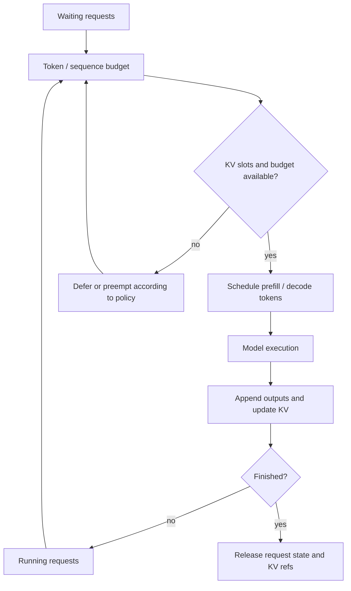

# LLM Inference / Serving Knowledge System Implementation Plan

> **For agentic workers:** REQUIRED SUB-SKILL: Use superpowers:subagent-driven-development (recommended) or superpowers:executing-plans to implement this plan task-by-task. Steps use checkbox (`- [ ]`) syntax for tracking.

**Goal:** 把 LLM Inference / Serving 重构为面向 AI Infra / Serving 工程师的端到端知识路径，并让 12 张 Mermaid 架构图、流程图和时序图在 Markdown 与生成 HTML 中共享同一份图源。

**Architecture:** `[[llm-inference]]` 作为专题入口，Concept 页面承载稳定机制，Entity 页面承载项目边界，Analysis 页面承载横向比较与选型。先扩展静态 HTML builder 的 Mermaid 渲染和失败回退，再按请求生命周期补齐内容，最后统一校准项目事实、导航、索引、日志和生成物。

**Tech Stack:** Markdown, YAML frontmatter, Obsidian wikilinks, Mermaid 10.9.0, Python 3.11+, Python Markdown, `unittest`, static HTML/CSS.

**Design:** `docs/superpowers/specs/2026-10-03-llm-inference-serving-knowledge-system-design.md`

---

## File map

### Build and verification

- Modify `wiki/html-assets/build.py`: detect Mermaid fences, emit fallback/render containers, inject assets only when needed, rerender on theme change.
- Modify `wiki/html-assets/style.css`: responsive diagram container, source fallback, dark/light theme presentation.
- Create `wiki/html-assets/test_build.py`: focused unit tests for Mermaid conversion and conditional asset injection.

### Core learning path

- Modify `wiki/concepts/llm-inference.md`: topic hub, A1/A2/F2/S1, workload and SLO entry points.
- Create `wiki/concepts/continuous-batching.md`: F1 and scheduling mechanics.
- Create `wiki/concepts/llm-serving-performance.md`: metrics, workload envelope, capacity and benchmarking.
- Create `wiki/concepts/llm-serving-reliability.md`: S4, overload and failure contracts.
- Modify `wiki/concepts/disaggregated-serving.md`: A3/S2 and KV handoff contract.
- Modify `wiki/concepts/inference-routing.md`: F3 and routing feedback loop.

### Maps and calibration

- Modify `wiki/analysis/llm-inference-serving-project-map.md`: A4/S3 and current project boundary matrix.
- Modify `wiki/analysis/llm-serving-engine-selection-map.md`: F4 and workload/SLO-first selection.
- Modify existing mechanism pages: `paged-attention.md`, `radix-attention.md`, `kv-cache-offload.md`, `elastic-kv-cache.md`, `batch-inference.md`, `model-serving-operator.md`.
- Modify anchor entities: `vllm.md`, `sglang.md`, `dynamo.md`, `llm-d.md`, `aibrix.md`.
- Modify `wiki/index.md`, `wiki/log.md`, and generated files under `wiki/html/`.

---

### Task 1: Add reusable Mermaid rendering to the HTML builder

**Files:**
- Create: `wiki/html-assets/test_build.py`
- Modify: `wiki/html-assets/build.py:398-465,683-731`
- Modify: `wiki/html-assets/style.css` after the existing code/table styles

- [ ] **Step 1: Add failing conversion tests**

Create `wiki/html-assets/test_build.py` with this complete module:

```python
import importlib.util
import sys
import unittest
from pathlib import Path

BUILD_PATH = Path(__file__).with_name("build.py")
SPEC = importlib.util.spec_from_file_location("wiki_html_build", BUILD_PATH)
assert SPEC and SPEC.loader
build = importlib.util.module_from_spec(SPEC)
sys.modules[SPEC.name] = build
SPEC.loader.exec_module(build)


class MermaidRenderingTests(unittest.TestCase):
    def make_page(self, body: str):
        return build.Page(
            Path("wiki/concepts/test.md"),
            "concepts",
            build.Frontmatter(title="Test"),
            body,
            "Test",
        )

    def test_mermaid_block_becomes_progressive_figure(self):
        html = '<pre><code class="language-mermaid">flowchart LR\nA --&gt; B\n</code></pre>'
        rendered, found = build.render_mermaid_blocks(html)
        self.assertTrue(found)
        self.assertIn('class="mermaid-figure"', rendered)
        self.assertIn('class="mermaid-source"', rendered)
        self.assertIn('class="mermaid"', rendered)
        self.assertIn("A --&gt; B", rendered)

    def test_plain_code_does_not_enable_mermaid(self):
        html = '<pre><code class="language-text">A --&gt; B</code></pre>'
        rendered, found = build.render_mermaid_blocks(html)
        self.assertFalse(found)
        self.assertEqual(html, rendered)

    def test_page_only_loads_mermaid_when_needed(self):
        mermaid_page = self.make_page("```mermaid\nflowchart LR\nA --> B\n```")
        plain_page = self.make_page("```text\nA --> B\n```")
        mermaid_html = build.build_page(mermaid_page, build.Resolver())
        plain_html = build.build_page(plain_page, build.Resolver())
        self.assertIn("mermaid@10.9.0", mermaid_html)
        self.assertNotIn("mermaid@10.9.0", plain_html)


if __name__ == "__main__":
    unittest.main()
```

- [ ] **Step 2: Run tests and confirm the missing helper fails**

Run:

```bash
python3 -m unittest wiki/html-assets/test_build.py -v
```

Expected: `ERROR` or `FAIL` because `render_mermaid_blocks` does not exist and pages do not inject Mermaid assets.

- [ ] **Step 3: Implement Mermaid conversion and conditional assets**

In `build.py`, add:

```python
MERMAID_VERSION = "10.9.0"
MERMAID_BLOCK_RE = re.compile(
    r'<pre><code class="language-mermaid">(.*?)</code></pre>', re.DOTALL
)

def render_mermaid_blocks(body_html: str) -> tuple[str, bool]:
    found = False

    def repl(match: re.Match) -> str:
        nonlocal found
        found = True
        source = match.group(1)
        return (
            '<figure class="mermaid-figure">'
            '<pre class="mermaid-source" aria-label="Mermaid diagram source"><code>'
            f'{source}</code></pre>'
            '<div class="mermaid" hidden aria-hidden="true"></div>'
            '</figure>'
        )

    return MERMAID_BLOCK_RE.sub(repl, body_html), found
```

After Markdown conversion and table wrapping, call `render_mermaid_blocks`. When `has_mermaid` is true, pass these values to two new `SHELL` placeholders:

```python
extra_head = (
    f'<script src="https://cdn.jsdelivr.net/npm/mermaid@{MERMAID_VERSION}/dist/mermaid.min.js"></script>'
    if has_mermaid else ""
)
extra_script = MERMAID_RUNTIME if has_mermaid else ""
```

Define the runtime exactly as follows. It copies source text into fresh render targets, rerenders after the existing theme listener changes `data-theme`, and leaves source visible on failure:

```python
MERMAID_RUNTIME = r"""
<script>
  async function renderMermaidDiagrams() {
    const figures = Array.from(document.querySelectorAll(".mermaid-figure"));
    if (!figures.length || !window.mermaid) return;
    const theme = document.documentElement.getAttribute("data-theme") === "light"
      ? "default" : "dark";
    const nodes = [];
    for (const figure of figures) {
      const source = figure.querySelector(".mermaid-source");
      const target = figure.querySelector(".mermaid");
      figure.classList.remove("is-rendered");
      figure.querySelector(".mermaid-error")?.remove();
      target.removeAttribute("data-processed");
      target.replaceChildren(document.createTextNode(source.textContent));
      target.hidden = false;
      target.setAttribute("aria-hidden", "false");
      nodes.push(target);
    }
    try {
      mermaid.initialize({ startOnLoad: false, theme, securityLevel: "strict" });
      await mermaid.run({ nodes });
      figures.forEach((figure) => figure.classList.add("is-rendered"));
    } catch (error) {
      for (const figure of figures) {
        figure.classList.remove("is-rendered");
        const target = figure.querySelector(".mermaid");
        target.hidden = true;
        target.setAttribute("aria-hidden", "true");
        const message = document.createElement("p");
        message.className = "mermaid-error";
        message.textContent = "图表渲染失败，以下保留 Mermaid 源码。";
        figure.appendChild(message);
      }
      console.error("Mermaid rendering failed", error);
    }
  }
  renderMermaidDiagrams();
  document.getElementById("theme-toggle").addEventListener("click", renderMermaidDiagrams);
</script>
"""
```

- [ ] **Step 4: Add progressive-enhancement CSS**

Add exact behavior to `style.css`:

```css
.mermaid-figure { margin: 20px 0; padding: 14px; overflow-x: auto; border: 1px solid var(--border); border-radius: var(--radius); background: var(--bg-elev); }
.mermaid-figure .mermaid { min-width: 680px; text-align: center; }
.mermaid-figure .mermaid svg { max-width: none; height: auto; }
.mermaid-figure.is-rendered .mermaid-source { display: none; }
.mermaid-error { margin: 8px 0 0; color: var(--warn); font-size: 13px; }
@media (max-width: 760px) { .mermaid-figure { margin-inline: -6px; padding: 10px; } }
```

- [ ] **Step 5: Run focused tests and compile check**

Run:

```bash
python3 -m unittest wiki/html-assets/test_build.py -v
python3 -m py_compile wiki/html-assets/build.py
```

Expected: all tests pass and compilation exits 0.

- [ ] **Step 6: Commit builder support**

```bash
git add wiki/html-assets/build.py wiki/html-assets/style.css wiki/html-assets/test_build.py
git commit -m "query: Render Mermaid diagrams in generated wiki pages"
```

### Task 2: Add continuous batching and performance foundations

**Files:**
- Create: `wiki/concepts/continuous-batching.md`
- Create: `wiki/concepts/llm-serving-performance.md`

- [ ] **Step 1: Prove both concepts are absent**

Run:

```bash
test ! -e wiki/concepts/continuous-batching.md
test ! -e wiki/concepts/llm-serving-performance.md
```

Expected: exit 0.

- [ ] **Step 2: Create `continuous-batching.md` with F1**

Use complete frontmatter (`title`, `tags`, `date: 2026-10-03`, `sources`, `related`) and these sections: `问题模型`, `F1 · 一次 Engine Iteration`, `Prefill 与 Decode 如何共享预算`, `Chunked Prefill`, `Preemption 与公平性`, `关键调参`, `不要从图中推断什么`.

F1 must use this Mermaid logic:



Explain that scheduling policy, chunk size, preemption mode and mixed prefill/decode support are engine/version dependent.

- [ ] **Step 3: Create `llm-serving-performance.md`**

Use sections: `Workload Envelope`, `Latency Metrics`, `Throughput and Goodput`, `Capacity Envelope`, `Benchmark Matrix`, `Reading Results Safely`. Define TTFT, ITL/TPOT, E2E latency, token throughput, request throughput, goodput and concurrency. Require every comparison to state model, hardware, quantization, TP/PP/DP/EP, input/output length distribution, concurrency, streaming, cache hit ratio and percentiles.

- [ ] **Step 4: Validate frontmatter, diagram and cross-links**

Run a Python snippet using `build.parse_frontmatter` and `build.Resolver`; assert both pages have title/tags/date/sources/related, F1 exists exactly once, and every new `[[wikilink]]` resolves.

Expected: `checked 2 pages; missing links: 0`.

- [ ] **Step 5: Commit the two concepts**

```bash
git add wiki/concepts/continuous-batching.md wiki/concepts/llm-serving-performance.md
git commit -m "query: Add serving scheduling and performance concepts"
```

### Task 3: Add the production reliability contract

**Files:**
- Create: `wiki/concepts/llm-serving-reliability.md`

- [ ] **Step 1: Prove the page is absent**

Run: `test ! -e wiki/concepts/llm-serving-reliability.md`

Expected: exit 0.

- [ ] **Step 2: Create the reliability page with S4**

Use sections: `可靠性不是透明重试`, `S4 · 在线请求故障与降级时序`, `Overload and Backpressure`, `Timeout and Cancellation`, `Worker and Router Failure`, `Stale KV / Routing State`, `Failure Injection Matrix`.

S4 must cover these branches:

```mermaid
sequenceDiagram
  participant C as Client
  participant G as Gateway
  participant R as Router / EPP
  participant E as Engine worker
  C->>G: request + deadline
  G->>R: select eligible endpoint
  alt queue is bounded and full
    R-->>G: overload / no capacity
    G-->>C: reject or shed load
  else endpoint selected
    G->>E: forward request
    alt failure before first token
      E--xG: error / timeout
      G-->>C: retry only if policy and budget allow
    else failure after streaming starts
      E--xG: stream interrupted
      G-->>C: terminate stream; do not assume transparent replay
    end
  end
  Note over R,E: stale locality should reduce hit quality, not bypass engine KV validation
```

- [ ] **Step 3: Add the failure-injection matrix**

Include rows for gateway unavailable, EPP/router unavailable, worker not ready, prefill failure, KV transfer timeout, decode failure before/after first token, stale KV index, autoscaler lag and model-load failure. Columns: signal, safe response, state that may be lost, metric/log to inspect.

- [ ] **Step 4: Validate and commit**

Run frontmatter/wikilink checks plus `rg -n 'sequenceDiagram|bounded|first token|stale' wiki/concepts/llm-serving-reliability.md`.

Expected: all four concepts appear and links resolve.

```bash
git add wiki/concepts/llm-serving-reliability.md
git commit -m "query: Add LLM serving reliability model"
```

### Task 4: Rebuild the topic hub around one request lifecycle

**Files:**
- Modify: `wiki/concepts/llm-inference.md:1-169`

- [ ] **Step 1: Record the current hub baseline**

Run:

```bash
rg -n '^## |```text|```mermaid' wiki/concepts/llm-inference.md
```

Expected: existing ASCII overview is present and A1/A2/F2/S1 are absent.

- [ ] **Step 2: Replace the opening with audience, workload and SLO framing**

Set `date: 2026-10-03`; add the three new concepts to `related`. Start with `本页回答什么`, `先定义 Workload`, `先定义 SLO`, and a seven-step reading path. Link performance terms to `[[llm-serving-performance]]` rather than duplicating their full definitions.

- [ ] **Step 3: Add A1 and A2**

A1 must separate Client, Gateway/Traffic, Routing/Serving Platform, Engine and Compute/State, with a side control plane connected by dotted arrows. A2 must show `API Server → Engine Core (Scheduler + KVCacheManager) → GPU Worker / ModelRunner`, while noting SGLang uses different process/type names and the figure describes shared responsibilities rather than identical classes.

- [ ] **Step 4: Add S1 and F2**

S1 sequence: Client → Gateway/Frontend → Router/EPP decision → Engine scheduler → repeated ModelRunner steps → streamed tokens. Show KV events/metrics as asynchronous messages that do not block every token.

F2 flow: prompt tokens → allocate blocks → compute/seal → reuse locally, publish locality event, optionally offload/transfer → release refs → evict under pressure/expiry/model change.

- [ ] **Step 5: Replace the flat topic list with the approved reading path**

Use groups: execution (`continuous-batching`, Paged/Radix), state (`kv-cache-offload`, `elastic-kv-cache`), distribution (`disaggregated-serving`, parallelism), platform (`inference-routing`, `model-serving-operator`), operations (`llm-serving-performance`, `llm-serving-reliability`, batch/benchmark).

- [ ] **Step 6: Run hub assertions and commit**

Assert A1/A2/F2/S1 each occur once, all four Mermaid fences close, and all three new concepts resolve.

```bash
git add wiki/concepts/llm-inference.md
git commit -m "query: Rebuild LLM inference learning path"
```

### Task 5: Deepen P/D and routing contracts

**Files:**
- Modify: `wiki/concepts/disaggregated-serving.md:1-99`
- Modify: `wiki/concepts/inference-routing.md:1-72`

- [ ] **Step 1: Capture existing headings and ASCII blocks**

Run: `rg -n '^## |```text|```mermaid' wiki/concepts/disaggregated-serving.md wiki/concepts/inference-routing.md`

Expected: the current lightweight flow/decision content exists; A3/S2/F3 are absent.

- [ ] **Step 2: Add A3 and S2 to disaggregated serving**

A3 must show separate prefill/decode pools, independent queues/scaling signals, KV metadata path and KV data path. S2 must show route-to-prefill, prefill result metadata, decode selection, direct or tiered KV transfer, readiness/timeout, decode and stream. Add a contract table for request identity, block/layout compatibility, transfer metadata, completion signal, cancellation, timeout and recompute policy.

- [ ] **Step 3: Add F3 to inference routing**

F3 flow must be: model/adapter capability filter → readiness/taints/policy filter → admission/queue → cache overlap and projected load scoring → endpoint pick → forward → KV/metrics/readiness feedback. Explain that Gateway/Proxy may consult an EPP/ext-proc service and then forward directly to the engine.

- [ ] **Step 4: Add explicit non-guarantees**

State that cache affinity is not unconditional stickiness, stale locality is an optimization-quality issue only when engine validation remains authoritative, and routing cannot repair incompatible KV layouts or arbitrary mid-stream failures.

- [ ] **Step 5: Validate and commit**

Assert A3/S2/F3 each occur once, `sequenceDiagram` exists in P/D, and both pages link to performance and reliability.

```bash
git add wiki/concepts/disaggregated-serving.md wiki/concepts/inference-routing.md
git commit -m "query: Clarify P-D and inference routing contracts"
```

### Task 6: Refresh the project and selection maps

**Files:**
- Modify: `wiki/analysis/llm-inference-serving-project-map.md:1-435`
- Modify: `wiki/analysis/llm-serving-engine-selection-map.md:1-110`

- [ ] **Step 1: Recheck official upstream evidence**

Read the current official architecture/release pages for vLLM, SGLang, Dynamo, llm-d and AIBrix. Record the observed release/tag or commit and date in the project map. Use official project docs or repositories only; keep 2026-09 Source snapshots unchanged.

- [ ] **Step 2: Replace D1-D5 duplication with A4 and S3**

Keep useful comparison prose, but make A4 the canonical control-plane diagram and S3 the canonical autoscaling sequence. A4 separates desired state, planner/autoscaler, operator/HPA actuation, worker readiness and request/event planes. S3 shows metrics → decision → desired replicas → pod startup/model load → readiness → endpoint discovery; include scale-up lag and queue/load-shedding protection.

- [ ] **Step 3: Refresh the project matrix**

Rows must cover vLLM, SGLang, Dynamo, llm-d, AIBrix and infrastructure references. Columns: primary layer, owns request path?, owns local KV?, P/D role, control-plane role, maturity/evidence date, best fit, avoid-if, next verification. Do not compare engines directly with control planes as substitutes.

- [ ] **Step 4: Rebuild selection around F4**

F4 decision tree starts with workload (online/batch, model family, context/output lengths), then SLO, hardware/topology, engine, distributed shape, routing/control plane and operational constraints. Retain explicit combinations and avoid-if conditions.

- [ ] **Step 5: Validate facts and commit**

Check A4/S3/F4, evidence date `2026-10-03`, five anchor projects, WVA deprecated warning, and links to all three new concepts.

```bash
git add wiki/analysis/llm-inference-serving-project-map.md wiki/analysis/llm-serving-engine-selection-map.md
git commit -m "query: Refresh LLM serving architecture and selection maps"
```

### Task 7: Reconcile mechanism pages and anchor entities

**Files:**
- Modify: `wiki/concepts/paged-attention.md`
- Modify: `wiki/concepts/radix-attention.md`
- Modify: `wiki/concepts/kv-cache-offload.md`
- Modify: `wiki/concepts/elastic-kv-cache.md`
- Modify: `wiki/concepts/batch-inference.md`
- Modify: `wiki/concepts/model-serving-operator.md`
- Modify: `wiki/entities/vllm.md`
- Modify: `wiki/entities/sglang.md`
- Modify: `wiki/entities/dynamo.md`
- Modify: `wiki/entities/llm-d.md`
- Modify: `wiki/entities/aibrix.md`

- [ ] **Step 1: Update dates and relationship metadata**

Set changed pages to `date: 2026-10-03`. Add only relevant new Concept links to `related`; retain existing Source references and do not invent raw sources.

- [ ] **Step 2: Reconcile mechanism boundaries**

Paged/Radix pages must link local block/prefix semantics to F2 without claiming identical structures. KV offload must distinguish copy location, locality index and engine validation. Elastic KV must remain about physical backing elasticity, not generic offload. Batch inference must distinguish asynchronous job control from continuous batching. Model-serving operator must separate reconcile/actuation from per-request data flow.

- [ ] **Step 3: Refresh anchor entity summaries**

vLLM: V1 API Server / Engine Core / workers and KV manager. SGLang: Scheduler / ModelRunner / RadixCache and version-scoped P/D integrations. Dynamo: modular request/event/control planes, routing, P/D and planner/operator. llm-d: Proxy+EPP, InferencePool, Model Server, KEDA/HPA path and deprecated WVA. AIBrix: v0.7 multi-engine control/data plane, routing, P/D, batch and preview maturity notes.

- [ ] **Step 4: Run baseline-aware link checks**

Build a set of unresolved wikilinks before changes and after changes; assert the after-set introduces no new missing targets. Assert every changed page has all five required frontmatter keys.

Expected: `new missing wikilinks: 0; checked pages: 11`.

- [ ] **Step 5: Commit calibration**

```bash
git add wiki/concepts/paged-attention.md wiki/concepts/radix-attention.md wiki/concepts/kv-cache-offload.md wiki/concepts/elastic-kv-cache.md wiki/concepts/batch-inference.md wiki/concepts/model-serving-operator.md wiki/entities/vllm.md wiki/entities/sglang.md wiki/entities/dynamo.md wiki/entities/llm-d.md wiki/entities/aibrix.md
git commit -m "query: Align LLM serving mechanisms and project boundaries"
```

### Task 8: Integrate navigation, build output and final verification

**Files:**
- Modify: `wiki/index.md`
- Modify: `wiki/log.md`
- Regenerate: `wiki/html/index.html`, `wiki/html/log.html`, `wiki/html/graph.html`, `wiki/html/graph-data.json`, and affected files under `wiki/html/{concepts,entities,analysis}/`

- [ ] **Step 1: Update the index reading path**

Under `LLM Serving 执行层`, order the conceptual path as `llm-inference` → `continuous-batching` → Paged/Radix/KV → `disaggregated-serving` → `inference-routing` → `llm-serving-performance` → `llm-serving-reliability` → project map → selection map. Add concise descriptions for the three new concepts.

- [ ] **Step 2: Update builder reading-path metadata**

In `READING_PATHS`, change the LLM Serving path to include `基础`, `调度`, `分布式`, `性能`, `可靠性`, `地图`, `选型` steps with the corresponding stems. Keep the homepage card concise.

- [ ] **Step 3: Append the durable log entry**

Append exactly:

```markdown
## [2026-10-03] query | Optimize LLM Inference / Serving knowledge system
```

Summarize the end-to-end path, 12-diagram system, three new concepts, refreshed upstream evidence and generic Mermaid support below the heading, following existing log style.

- [ ] **Step 4: Run complete structural verification**

Run a Python check that:

- parses required frontmatter on every touched Markdown page;
- finds A1-A4, F1-F4 and S1-S4 exactly once in their canonical pages;
- confirms all Mermaid fences are balanced;
- confirms no new unresolved wikilinks against the pre-change baseline;
- confirms the three new pages have inbound links from both index and topic hub.

Expected: `12 diagrams; 3 new concepts; new missing links: 0`.

- [ ] **Step 5: Build twice and prove idempotence**

```bash
./wiki/html-assets/build.py
git diff -- wiki/html > /private/tmp/llm-serving-html-first.diff
./wiki/html-assets/build.py
git diff -- wiki/html > /private/tmp/llm-serving-html-second.diff
cmp /private/tmp/llm-serving-html-first.diff /private/tmp/llm-serving-html-second.diff
```

Expected: both builds succeed and `cmp` exits 0.

- [ ] **Step 6: Verify conditional Mermaid output and local links**

Assert generated pages with diagrams contain `mermaid@10.9.0`, a plain page does not, all generated relative `href` targets exist, and no generated page contains `wikilink-missing` for newly added links.

- [ ] **Step 7: Perform browser verification**

Serve `wiki/html/` locally. Inspect at least A1 flowchart and S2 sequence diagram in dark theme, light theme and a viewport no wider than 760px. Disable the Mermaid request once and verify source fallback remains readable. Record the exact pages and outcomes in the log entry.

- [ ] **Step 8: Run final checks**

```bash
python3 -m unittest wiki/html-assets/test_build.py -v
python3 -m py_compile wiki/html-assets/build.py
git diff --check
git status --short
```

Expected: tests and compile pass, no whitespace errors, and status contains only files listed by this plan plus the pre-existing untracked M5D design file.

- [ ] **Step 9: Commit the integrated wiki operation**

```bash
git add wiki/index.md wiki/log.md wiki/html-assets/build.py wiki/html-assets/style.css wiki/html
git commit -m "query: Optimize LLM inference serving knowledge path"
```

Do not stage `docs/superpowers/specs/2026-09-28-m5d-platform-gpu-integration-design.md`.
