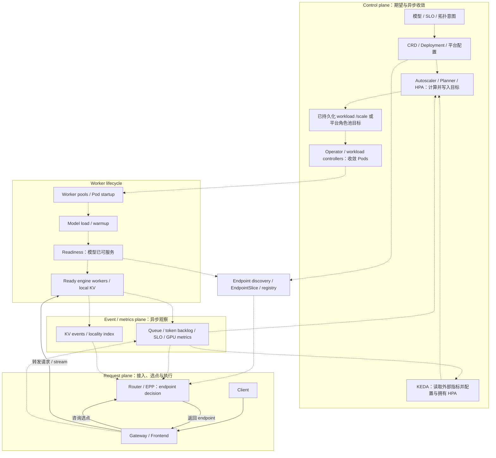
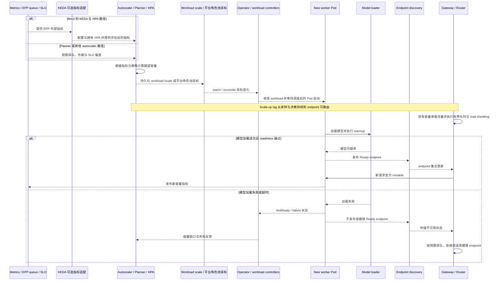

# LLM Inference / Serving 项目地图

本页回答“谁拥有哪一层职责，以及控制面如何把容量变成可接流量的 endpoint”。[[vllm]] / [[sglang]] 是执行引擎，[[dynamo]] 组织分布式 runtime，[[llm-d]] / [[aibrix]] 提供范围不同的 serving 与控制能力；这些层不能当成同类替代品。组合选择见 [[llm-serving-engine-selection-map]]。

请求执行的统一入口是 [[llm-inference]]，P/D 与 KV 交接见 [[disaggregated-serving]]，选点与异步信号见 [[inference-routing]]。本页只展开 Kubernetes 控制面及就绪传播，避免重复维护请求/KV 流程图。

## 当前上游核验（2026-10-03）

下表是 2026-10-03 对官方 GitHub release、固定 tag 源码及官方文档的直接核验。发布日期为 GitHub API 的 UTC 日期；release 标签与 latest/dev 文档分别记录，不推定二者完全一致。frontmatter 中的 Source 页面保留旧分析时点，其调用路径和配置不能自动外推到今天。

| 项目 | 核验版本与日期 | 当前观察及直接官方证据 | 使用边界 |
|------|----------------|--------------------------|----------|
| [[vllm]] | [v0.30.0](https://github.com/vllm-project/vllm/releases/tag/v0.30.0)，2026-09-22 发布；latest docs checked 2026-10-03 | [V1 进程架构](https://docs.vllm.ai/en/latest/design/arch_overview/#v1-process-architecture)区分 API Server、Engine Core、GPU Workers 与条件启用的 DP Coordinator | scheduler、local KV 与模型执行属于 engine；进程数及 connector 支持按部署版本核验 |
| [[sglang]] | [v0.5.21](https://github.com/sgl-project/sglang/releases/tag/v0.5.21)，2026-10-02 发布 | 固定 tag 中存在 [Scheduler](https://github.com/sgl-project/sglang/blob/v0.5.21/python/sglang/srt/managers/scheduler.py)、[ModelRunner](https://github.com/sgl-project/sglang/blob/v0.5.21/python/sglang/srt/model_executor/model_runner.py)、[RadixCache](https://github.com/sgl-project/sglang/blob/v0.5.21/python/sglang/srt/mem_cache/radix_cache.py)；[同 tag P/D 指南](https://github.com/sgl-project/sglang/blob/v0.5.21/docs/docs/advanced_features/pd_disaggregation.mdx)描述 Mooncake/NIXL 集成 | runtime 结构与 P/D backend 按版本和硬件限定，不等于全部特性可任意组合 |
| [[dynamo]] | [v1.5.0](https://github.com/ai-dynamo/dynamo/releases/tag/v1.5.0)，2026-09-21 发布；dev docs checked 2026-10-03 | [架构文档](https://docs.nvidia.com/dynamo/dev/knowledge-base/concepts/architecture)分离 request、event、discovery 及控制连接；Planner 决策、Operator 收敛 worker 数 | release 中的 backend 版本与独立引擎最新版分开；可模块化采用，不能假定所有 transport/缓存组件必选 |
| [[llm-d]] | [v0.10.0](https://github.com/llm-d/llm-d/releases/tag/v0.10.0)，2026-09-29 发布；[公开架构页](https://llm-d.ai/docs/architecture)仍标 v0.9 latest，checked 2026-10-03 | Proxy/EPP、InferencePool、Model Server 为核心；[dev 扩缩说明](https://llm-d.ai/docs/dev/architecture#autoscaling)为 EPP metrics → KEDA Prometheus scaler → HPA | release 已记录 WVA 指南废弃及 KV-cache 仓库迁入 router；旧 Source 保留迁移前边界 |
| [[aibrix]] | [v0.7.0](https://github.com/vllm-project/aibrix/releases/tag/v0.7.0)，2026-06-18 发布 | release 明确多引擎、KV-centric P/D、Batch API 和 HA Gateway；Console、Batch API、Resource Manager/Cloud GPU 仍有 preview 提示 | 按组件与目标引擎版本判断成熟度，不能把 production 表述当成所有 API 稳定承诺 |

> [!warning] Conflict
> 2026-10-03 核验时，[llm-d v0.9 架构页](https://llm-d.ai/docs/architecture#autoscaling)仍并列 HPA/KEDA 与 WVA；[dev 架构页](https://llm-d.ai/docs/dev/architecture#autoscaling)已将 WVA 标为 deprecated，[v0.10.0 release](https://github.com/llm-d/llm-d/releases/tag/v0.10.0)也确认 WVA 指南废弃并将仓库重命名为 llm-d-autoscaling。[[src-llm-d-workload-variant-autoscaler-architecture]] 与 [[llm-d-workload-variant-autoscaler]] 是历史设计参考，部署应核验目标 release 的扩缩路径，不能照搬旧 WVA 方案。

## 一句话分层

| 层 | 核心职责 | 对应项目或阅读入口 |
|----|----------|----------------------|
| 推理引擎 | token 调度、模型执行、local KV、设备/节点内外并行 | [[vllm]]、[[sglang]]；执行基础见 [[continuous-batching]]、[[paged-attention]]、[[radix-attention]] |
| 分布式 serving runtime | worker discovery、请求协调、P/D 组织、KV transfer 集成 | [[dynamo]]，并对照 engine-native 集成 |
| 请求路由与 serving 控制 | endpoint picking、入口策略、扩缩和部署生命周期的明确子集 | [[llm-d]]、[[aibrix]]、Dynamo 的可选控制组件；见 [[inference-routing]]、[[model-serving-operator]] |
| 异步任务与实验工具 | job/file/queue/output、benchmark、故障模拟 | [[batch-inference]]、[[llm-d-batch-gateway]]、[[llm-d-benchmark]]、[[llm-d-inference-sim]] |
| 资源与设备基础设施 | 集群位置、GPU 分配、拓扑、健康和容量 | [[src-skypilot-architecture|SkyPilot]]、[[k8s-gpu-device-stack]]、[[kubernetes]] |

## A4 · Kubernetes Serving 控制面

图注：这是 Kubernetes 部署的逻辑职责图，实线代表请求/选点交互，虚线代表异步控制、生命周期推进或信号。假设 readiness 检查覆盖模型可服务状态，endpoint 发现再把该状态传播给选点方。HPA 根据指标计算副本目标并写入 workload 的 `/scale`；workload controllers 再收敛 Pods。平台 Planner 也可写自己的角色池目标，由 Operator 转换并执行。图中是候选控制路径，每个目标只应有一个扩缩写入者。

不要从图中推断 Dynamo、llm-d、AIBrix 实现同一组框或能直接互换。Dynamo 的 [Planner/Operator 控制连接](https://docs.nvidia.com/dynamo/dev/knowledge-base/concepts/architecture#control-connections)、llm-d 的 [EPP/KEDA/HPA 组合](https://llm-d.ai/docs/dev/architecture#autoscaling)、AIBrix 的 [Gateway/controller/runtime 组件](https://aibrix.readthedocs.io/latest/getting_started/overview.html)拥有不同接口和对象。InferencePool/HTTPRoute 是配置与发现契约，Proxy/Frontend 才承接连接；EPP 咨询不要求 token stream 穿过 EPP 进程。控制权、信号时效及故障边界见 [[model-serving-operator]]、[[inference-routing]]。

## S3 · 扩缩与就绪传播时序

图注：这是一次扩容的逻辑时序，虚线表示异步状态/信号传播，横向距离不表示时长。假设所选 autoscaler、部署控制器和 discovery 能形成反馈闭环；GPU 容量不足、镜像拉取失败还可能让 Pod 在加载模型前停滞，同样不能计入可服务容量。

HPA 位于决策与目标写入侧：它计算 desired replicas 并更新目标 workload 的 `/scale`，不负责创建或收敛 Pods；Operator 与 Deployment 等 workload controllers 负责后续执行。平台 Planner 可改写自己的角色池目标，再由 Operator 收敛。在 llm-d 路径中，KEDA 的 Prometheus scaler 读取 EPP 信号，KEDA 配置并拥有 HPA、向其提供外部指标，HPA 执行副本决策。见 [Kubernetes HPA](https://kubernetes.io/docs/concepts/workloads/autoscaling/horizontal-pod-autoscale/)、[KEDA 概念](https://keda.sh/docs/2.18/concepts/)与 [llm-d dev 扩缩说明](https://llm-d.ai/docs/dev/architecture#autoscaling)。这里聚焦非零副本扩容，KEDA 的零副本激活路径需另按配置核验。

不要从图中推断期望副本增加即等于可用容量增加，或 Ready 保证后续每次请求成功。采样窗口、决策周期、GPU provisioning、镜像/权重下载、warmup 和发现传播均进入 scale-up lag；有界队列、admission/load shedding 必须显式配置。缩容需停止新选点、排空在飞请求，再终止 worker，不能简单反转扩容箭头。容量与 goodput 见 [[llm-serving-performance]]，重试、取消和 draining 见 [[llm-serving-reliability]]。readiness/EndpointSlice 语义见 [Kubernetes Pod 生命周期](https://kubernetes.io/docs/concepts/workloads/pods/pod-lifecycle/#pod-termination)。

## 横向对比

按主要层比较职责；“拥有请求路径”指直接参与请求执行或选点，“local KV”指引擎内布局、分配和有效性，区别于外部 index/transfer/storage。成熟度列记录可核验版本与限制，不是性能或生产质量排名。

| 项目 | Primary layer | Owns request path? | Owns local KV? | P/D role | Control-plane role | Maturity / evidence date | Best fit | Avoid-if | Next verification |
|------|---------------|--------------------|----------------|----------|--------------------|--------------------------|----------|----------|-------------------|
| [[vllm]] | Engine | 是，API/engine execution | 是，KV blocks 与 scheduler | engine 角色与 connector | 实例执行协调，不包办 fleet | v0.30.0 + V1 latest docs，2026-10-03 | 建立目标模型/硬件的可测基线 | 目标模型或硬件不支持关键要求 | 模型质量、batching、CPU 配额、TTFT/ITL、connector |
| [[sglang]] | Engine/runtime | 是，服务进程与执行 | 是，RadixCache/KV pools | 版本限定的 Mooncake/NIXL 等集成 | 实例/并行组协调 | v0.5.21 tag，2026-10-03 | 前缀复用或执行特性匹配负载 | 目标特性组合尚无硬件验证 | prefix 分布、特性共存、P/D timeout/cancel |
| [[dynamo]] | Distributed runtime | 是，Frontend/Router/worker 协作 | 底层 engine 拥有，外围索引/传输按组件 | 组织 aggregated 或分离 worker pools | Planner 决策、Operator 收敛等可选模块 | v1.5.0 + dev docs，2026-10-03 | 多节点协调有实测收益 | 普通副本达标，或网络/KV 成本抵消收益 | 高采用成本，核对 backend pins、transport、故障与 goodput |
| [[llm-d]] | K8s routing/serving stack | 是，Proxy + EPP，engine 执行 | 否，engine 拥有，生态提供索引/offload | 路由与 sidecar 协调，依 engine 契约 | InferencePool 发现与 EPP metrics，扩缩配 KEDA/HPA | release v0.10.0 / docs v0.9 与 dev，2026-10-03 | 需要 inference-aware endpoint picking | 普通 LB 达标或不能运维 Gateway/EPP | 中到高成本，验证 Gateway/GAIE、组件矩阵、WVA 迁移与陈旧信号 |
| [[aibrix]] | Serving/control plane | 是，Gateway plugins 与 PD 路由 | engine 拥有，外围 KV substrate/connector 集成 | 多引擎路由与角色编排 | controllers、autoscaling、model/adapter lifecycle | v0.7.0，2026-10-03，部分模块 preview | 多项明确的 fleet 运维需求 | 控制器重叠或 preview API 不能接受 | 按组件计成本，验证引擎适配、CRD 升级、HA 状态与 replica 所有权 |
| [[src-skypilot-architecture|SkyPilot]] | 资源控制面 | 资源选择不逐请求执行，Serve 子系统另计 | 否 | 部署/供给底层 worker | 云/K8s/Slurm 资源与任务生命周期 | [README](https://github.com/skypilot-org/skypilot)，checked 2026-10-03，内部细节取旧 Source | 跨集群资源位置与容量选择 | 单集群已满足资源管理需求 | 云凭据/配额、启动时延、恢复与现有 scheduler 分工 |
| [[k8s-gpu-device-stack]] | 设备基础设施 | 否 | 否 | 提供设备、网络与拓扑约束 | GPU 分配、驱动、健康、观测 | [Kubernetes GPU 指南](https://kubernetes.io/docs/tasks/manage-gpus/scheduling-gpus/)，checked 2026-10-03 | 上述项目的 GPU 运行底座 | 试图用设备插件解决 token 调度或缓存路由 | 驱动/镜像、隔离、NUMA/NVLink/RDMA、健康与真实可分配容量 |

## 架构交叉矩阵

| 共同设计问题 | 分工与接口 | 深入阅读 |
|--------------|------------|----------|
| KV 复用 | engine 验证身份/布局，routing 使用 locality signal，transfer/offload 处理搬运与存储 | [[paged-attention]]、[[radix-attention]]、[[kv-cache-offload]] |
| 请求与 GPU 工作组织 | endpoint 选点和 engine 内 batch 调度独立，通过队列与缓存状态相互影响 | [[inference-routing]]、[[continuous-batching]] |
| P/D 池与容量 | engine connector、网络和角色池编排共同定义可用组合 | [[disaggregated-serving]] |
| 多 variant allocation | 历史 WVA 的成本/容量思想仍可研究，采用要核验废弃状态 | [[llm-d-workload-variant-autoscaler]] |
| Batch / benchmark / simulator | 异步任务、可复现实验和无 GPU 控制面测试各有边界 | [[llm-d-batch-gateway]]、[[llm-d-benchmark]]、[[llm-d-inference-sim]] |

## 核心设计轴

1. **KV 所有权与身份**：引擎决定 local KV 是否有效，外部索引给出可能命中的线索。跨 worker/存储层复用还需模型版本、token 前缀、布局和失效契约，见 [[kv-cache-offload]]。
2. **执行与编排边界**：引擎可跨设备/节点并行；runtime 处理实例间请求协作；Kubernetes 控制器收敛期望状态与容量。跨节点并行本身不意味着必须引入 Dynamo，见 [[llm-inference]]。
3. **P/D 资源形态**：角色比例、拓扑、KV transfer 与独立扩缩需共同决定。不能从“prefill 计算密集、decode 访存敏感”的概括直接得出部署答案，见 [[disaggregated-serving]]。
4. **复用与排队权衡**：热 prefix worker 可能过载；cache-hit 高不保证 TTFT/ITL 达标。路由信号要有时效，评估最终达标的请求量，见 [[inference-routing]]、[[llm-serving-performance]]。
5. **设备与容量约束**：GPU sharing、拓扑、权重和 KV 占用改变可分配容量；request autoscaling、Pod 调度与节点供给有不同周期，见 [[k8s-gpu-device-stack]]。

## 项目工程剖面

### [[vllm]]：可测量的执行基线

V1 的 API/Engine Core/GPU worker 分工要求部署同时为 tokenization/调度保留 CPU。工程研究入口是 scheduler token budget、local KV block 管理及模型/attention backend 支持；旧版代码剖面见 [[src-vllm-architecture]]，当前进程边界见 [V1 文档](https://docs.vllm.ai/en/latest/design/arch_overview/#v1-process-architecture)。采用成本集中于镜像、权重、并行和特性组合，模型支持列表不能承诺目标 SLO。

### [[sglang]]：执行路径与前缀复用

当前 Scheduler、ModelRunner、RadixCache 源码见核验表；[[src-sglang-architecture]] 保存早期 HTTP/TokenizerManager/Scheduler/DetokenizerManager 与 forward mode 剖面。prefix reuse、chunking、speculative decoding 和 P/D 应组合验证，避免外推单项优化收益。[v0.5.21 P/D 指南](https://github.com/sgl-project/sglang/blob/v0.5.21/docs/docs/advanced_features/pd_disaggregation.mdx)限定 backend、安装与拓扑配置。

### [[dynamo]]：模块化分布式协作

工程重点是 worker membership、信号延迟、KV transfer、Planner 与 Operator 的所有权。[v1.5.0 release](https://github.com/ai-dynamo/dynamo/releases/tag/v1.5.0)列出的 engine 依赖为 vLLM v0.28.0、SGLang v0.5.18，并记录 backend 已知限制；不能把本页所有独立最新版直接拼成已验证栈。

KVBM 已在 Dynamo v1.5.0 被标为 deprecated，计划在 v1.6.0 移除；host/disk 分层 offload 用户应迁向 engine-native KV offloading。KV Cache Runner（KVCR）是针对跨节点 KV 共享的独立早期项目，release 明确它不替代 KVBM。上述状态来自 [v1.5.0 release 的废弃与迁移说明](https://github.com/ai-dynamo/dynamo/releases/tag/v1.5.0)。[[src-dynamo-architecture]] 保留整体架构与 cache offload 的历史快照，[[kv-cache-offload]] 中的项目映射也需按这一版本边界解读。

### [[llm-d]]：Gateway/EPP 与 Kubernetes serving 组合

Proxy 负责连接与流，EPP 选 endpoint，InferencePool 表达后端集合，Model Server 执行。[v0.10.0 release](https://github.com/llm-d/llm-d/releases/tag/v0.10.0)记录 KV-cache 仓库迁入 router、WVA 指南废弃及组件版本表；[[src-llm-d-architecture]]、[[src-llm-d-router-architecture]]、[[src-llm-d-kv-cache-architecture]] 反映早期仓库划分。迁移需核对镜像、chart、CRD 和插件配置，不能只升级总项目 tag。

### [[aibrix]]：多引擎 fleet 的组合式运维

[v0.7.0 release](https://github.com/vllm-project/aibrix/releases/tag/v0.7.0)让比较范围覆盖多引擎、P/D、Batch 与 HA Gateway，但组件成熟度并不一致。按需采用 Gateway、controller、AI Runtime 或 KV 能力，并明确 adapter 生命周期、状态恢复及副本写入权。旧剖面见 [[src-aibrix-architecture]]，serving API 边界比较见 [[src-k8s-serving-stack-comparison]]。

### 基础设施参照：资源位置与设备能力

[[src-skypilot-architecture|SkyPilot]] 的当前 [README](https://github.com/skypilot-org/skypilot)描述统一 Kubernetes、Slurm 与云资源入口；Source 中 Task/Dag/Resources、Optimizer 等细节属于原分析版本。[[src-k8s-gpu-device-plugins-stars]] 和 [[k8s-gpu-device-stack]] 组织 device plugin、GPU Operator、DRA/CDI、sharing 与 observability 的阅读路径；具体驱动/API 兼容性需独立核验，资源与设备层均不能替代 token 执行。

## 核心难点

- **吞吐与延迟**：[[continuous-batching]]、chunked prefill、speculative decoding 都改变资源和队列行为；按固定 workload 下满足 TTFT/ITL 的 goodput 与成本评价，见 [[llm-serving-performance]]。
- **缓存与排队**：locality 收益要减去热点排队、事件延迟与迁移成本。KV index 过期和 KV 数据损坏是不同故障，不能用同一 fallback 解释。
- **分离后的状态转移**：handoff、采样/约束解码状态、取消和已输出 token 的重试边界由 backend 契约决定，见 [[disaggregated-serving]]、[[llm-serving-reliability]]。
- **Offload 是缓存系统**：介质、evict/promote、身份去重、并发加载和重新 prefill 的机会成本共同决定收益，见 [[kv-cache-offload]]。
- **容量到达的时差**：决策、GPU provisioning、模型加载、readiness、endpoint discovery 各自可延迟或失败，扩容期间仍需入口保护。
- **跨层观测**：关联 TTFT/ITL、queue/token backlog、KV hit/transfer、GPU/显存、controller 决策和 provider capacity error，不能只看 HTTP 平均延迟。

## 选型与下一步验证

组合、avoid-if 与迁移成本见 [[llm-serving-engine-selection-map]]。本页没有同模型、同硬件、同 SLO 的跨项目实测，因此只给职责和验证顺序，不给性能排名。

1. 用 [[llm-d-benchmark]]、[[inference-perf]] 和 [[llm-d-inference-sim]] 统一 workload 与故障场景，分别测基线、路由和扩缩收益。
2. 按 release 核验 EPP/KEDA/HPA 路径及 WVA 迁移，建立与历史 Source 的配置差异清单。
3. 结合 [[kueue]]、[[karpenter]]、[[lws]]、[[jobset]] 测量 GPU 不足、模型冷启动和 worker group readiness 时间线。
4. 对 Gateway/EPP、P/D worker、KV 通道做故障注入，记录流式输出前后的取消、重试、超时和 draining 语义。

尚需补齐 engine/connector KV 身份与布局兼容矩阵、在飞请求恢复边界、GPU sharing/拓扑对 goodput 的影响。更多候选见 [[llm-d-kubernetes-sigs-candidate-map]]。
