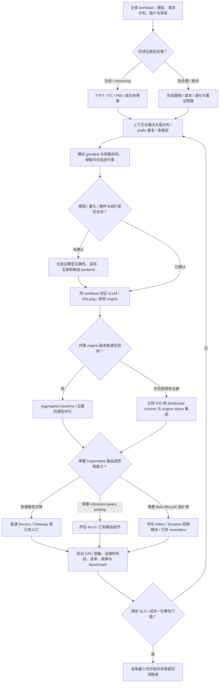

# LLM Serving / 推理引擎选型地图

选型从 workload 和 SLO 开始：先确定在线/批处理、输入输出分布、缓存重复与失败预算，再确认模型/硬件适配、engine、部署形态、routing/control plane 和运维约束。不存在统一最优栈；每层都应以真实负载的收益和运行成本决定是否加入。职责与控制面时序见 [[llm-inference-serving-project-map]]。

## 当前上游核验（2026-10-03）

以下 release 经官方 GitHub API 核验，日期为 UTC 发布日；文档观察以 2026-10-03 为准。旧 Source 保留原分析时点，不能用旧组件图或 latest 文档替代目标 release 的兼容矩阵。

| 项目 | 观察到的版本 | 本次选型证据与限制 |
|------|----------------|----------------------|
| [[vllm]] | [v0.30.0](https://github.com/vllm-project/vllm/releases/tag/v0.30.0)，2026-09-22 | [V1 latest 架构](https://docs.vllm.ai/en/latest/design/arch_overview/#v1-process-architecture)，checked 2026-10-03：API Server / Engine Core / GPU Workers 分进程，CPU 与 GPU 都需容量验证 |
| [[sglang]] | [v0.5.21](https://github.com/sgl-project/sglang/releases/tag/v0.5.21)，2026-10-02 | [Scheduler](https://github.com/sgl-project/sglang/blob/v0.5.21/python/sglang/srt/managers/scheduler.py)、[ModelRunner](https://github.com/sgl-project/sglang/blob/v0.5.21/python/sglang/srt/model_executor/model_runner.py)、[RadixCache](https://github.com/sgl-project/sglang/blob/v0.5.21/python/sglang/srt/mem_cache/radix_cache.py)；[P/D 集成](https://github.com/sgl-project/sglang/blob/v0.5.21/docs/docs/advanced_features/pd_disaggregation.mdx)受版本/backend 约束 |
| [[dynamo]] | [v1.5.0](https://github.com/ai-dynamo/dynamo/releases/tag/v1.5.0)，2026-09-21 | [dev 架构](https://docs.nvidia.com/dynamo/dev/knowledge-base/concepts/architecture)，checked 2026-10-03：模块化 request/event/discovery 与控制连接；该 release 的 vLLM/SGLang pins 与独立最新版不同 |
| [[llm-d]] | [v0.10.0](https://github.com/llm-d/llm-d/releases/tag/v0.10.0)，2026-09-29；[架构文档](https://llm-d.ai/docs/architecture)仍显示 v0.9 latest | [dev 扩缩路径](https://llm-d.ai/docs/dev/architecture#autoscaling)，checked 2026-10-03：EPP metrics → KEDA/HPA，WVA deprecated；release 记录 WVA 指南废弃与组件迁移 |
| [[aibrix]] | [v0.7.0](https://github.com/vllm-project/aibrix/releases/tag/v0.7.0)，2026-06-18 | 多引擎、P/D、Batch、HA Gateway 均进入比较范围；Console、Batch API、Resource Manager/Cloud GPU 保留 preview 提示 |

> [!warning] Conflict
> WVA 旧设计见 [[llm-d-workload-variant-autoscaler]]。2026-10-03 的 [llm-d dev 文档](https://llm-d.ai/docs/dev/architecture#autoscaling)明确 WVA deprecated，[v0.10.0 release](https://github.com/llm-d/llm-d/releases/tag/v0.10.0)确认指南废弃，但 v0.9 架构页仍并列 WVA 与 HPA/KEDA。新部署应核验目标 release 的 EPP/KEDA/HPA 配置，旧 Source 不作为当前默认方案。

## F4 · Workload / SLO-first 选型决策树

图注：箭头表示收集证据的评估顺序，不是运行时调用。假设模型质量与 API 语义已列入门槛；在线与 batch 混合时应分别测量并验证隔离。TTFT/ITL 主要约束交互请求，batch 还看完成期限与单位成本，见 [[batch-inference]]、[[llm-serving-performance]]。

不要从图中推断分支互斥、某项目必选，或 P/D 一定修复吞吐/延迟问题。llm-d、AIBrix、Dynamo 有职责重叠，可在接口明确时组合；每个副本目标必须只有一个写入者。P/D 收益需覆盖 KV transfer、网络拓扑与故障成本，见 [[disaggregated-serving]]；本页不指定统一最优 engine 或 stack。

## 决策输入与通过条件

| 顺序 | 必须记录的输入 | 通过条件与下一步 |
|------|----------------|------------------|
| Workload | 在线/离线、到达率与突发、模型/量化、上下文与输出分布、prefix 重复、多模态、LoRA | 可回放代表性请求，不能只用平均长度或单条 demo |
| SLO | TTFT/ITL 分位数、成功率、deadline、goodput、成本上限 | 固定统计窗口、负载和超时/拒绝计数口径，见 [[llm-serving-performance]] |
| Hardware / topology | GPU/显存、CPU、NUMA/NVLink/RDMA、模型存储与配额 | 模型正确运行，通信与冷启动可测，见 [[k8s-gpu-device-stack]] |
| Engine | 模型/量化、scheduler/KV、并行、API、输出正确性 | 同环境比较 [[vllm]]、[[sglang]] 与适用的其他 engine；[[continuous-batching]] 按负载调优 |
| Distributed shape | 单副本瓶颈、模型并行、共置副本、P/D 与 KV transfer | 实测显示收益才增加分离/runtime，见 [[llm-inference]]、[[disaggregated-serving]] |
| Routing / control plane | locality/load 信号、发现、扩缩、adapter lifecycle、批任务 | 明确状态 owner，验证 readiness 与路由传播，见 [[inference-routing]] |
| Operations | 发布/回滚、监控、值班、配额、状态依赖、隔离、故障预算 | 演练冷启动、过载、worker/网络失败与 draining，见 [[llm-serving-reliability]] |

## 选项目时比较同一层

| 候选 | Best fit | Avoid-if | 采用 / 迁移成本 | 下一步核验 |
|------|----------|----------|------------------|------------|
| [[vllm]] | 目标模型/硬件可用，需要执行与 API 基线 | 必需模型、量化或 backend 特性未支持 | 低到中；镜像、权重、API、并行与监控；换 engine 需重验输出和缓存行为 | TTFT/ITL/goodput、CPU 配额、显存、稳定性与 [[paged-attention]] |
| [[sglang]] | prefix reuse 或执行特性在目标流量上有收益 | 关键模型/硬件或高级特性组合未验证 | 低到中；重新调参和输出回归，P/D backend 增加复杂度 | [[radix-attention]] 命中收益、chunking/speculation 共存、尾延迟和取消 |
| [[dynamo]] | 多节点 worker 协作、P/D 或 KV routing 值得集中协调 | 共置副本达标，或网络/运维成本超过收益 | 高；worker 集成、runtime、状态/传输、Planner/Operator 与观测 | 固定 backend pins，比较 aggregated/P/D，测试 transfer、failure 与 readiness |
| [[llm-d]] | K8s 上需要 Gateway API、EPP、InferencePool 与智能路由 | 普通 Service/LB 足够，或缺 K8s/Gateway 运维条件 | 中到高；CRD/chart/Proxy/EPP 兼容及旧插件、WVA/KV-cache 迁移 | release 组件矩阵、信号时效、KEDA/HPA 所有权、fallback 与实际收益 |
| [[aibrix]] | 路由、扩缩、model/adapter lifecycle 或多引擎 fleet 缺口明确 | 所需能力已有 owner，或 preview API 不能接受 | 中到高；按组件引入 controller/CRD/runtime，确认状态迁移与回滚 | engine 支持版本、HA 状态同步、controller 恢复、Batch/Console 成熟度 |

不同层不能组成 engine 单选题。引擎先通过模型与 SLO 验收，外围层再处理其边界之外的问题；GPU 基础设施是所有组合的运行条件。跨云/K8s/Slurm 资源位置需求可另评估 [[src-skypilot-architecture|SkyPilot]]，当前范围见[官方 README](https://github.com/skypilot-org/skypilot)。

## 组合方案

| 模式 | 组成 | Best fit | Avoid-if | Adoption cost | 下一步核验 |
|------|------|----------|----------|---------------|------------|
| 最小 engine service | [[vllm]] 或 [[sglang]] + 普通 Service/Gateway | 单集群普通副本已达标 | 已测出 KV-aware routing、P/D 或 lifecycle 缺口 | 低；engine、镜像、模型、监控与入口 | 冷/热缓存回放、P99/goodput、升级和实例故障 |
| K8s 智能路由 | engine + [[llm-d]] Proxy/EPP/InferencePool | KV/负载/模型信号改善选点 | 收益不足以覆盖额外组件与信号维护 | 中到高；入口、CRD、EPP 与扩缩集成 | 对照普通 LB，测陈旧信号、扩缩传播及 EPP 故障 |
| Distributed runtime | engine + [[dynamo]] 的所需模块 | P/D 或 worker 协作对 SLO 有实测收益 | 带宽/backend 约束不满足，或普通副本足够 | 高；worker pools、transport、可选状态与控制模块 | 按 pins 验证 KV transfer、取消、角色扩缩与网络故障 |
| Inference operations platform | engine + 选定 [[aibrix]] 组件 | fleet、autoscaling 或多引擎运维缺口明确 | 与已有 Gateway/autoscaler/operator 重复管理状态 | 中到高；组件级 CRD、runtime 与状态恢复 | reconciliation、升级/回滚、HA 与 replica ownership |
| 异步 batch 服务 | engine + [[llm-d-batch-gateway]] 或 AIBrix Batch 等任务层 | 需要任务提交/查询/取消、文件 I/O 与 deadline 管理 | 只需本地离线执行，或 API 成熟度不符要求 | 中到高；持久队列、任务状态、结果、幂等与调度 | [[batch-inference]] 生命周期、重试、完成时限及在线流量隔离 |

组合是候选设计，不代表任意版本交叉兼容。[Dynamo v1.5.0](https://github.com/ai-dynamo/dynamo/releases/tag/v1.5.0)的引擎依赖与本页独立 release 不同，[AIBrix v0.7.0](https://github.com/vllm-project/aibrix/releases/tag/v0.7.0)的 Batch API 仍有 preview 提示。混合平台前，逐项确认 request ownership、KV 契约、扩缩写入权、状态后端和升级顺序。

## 采用前的最小证据包

保留模型与 engine/container 版本、硬件/拓扑、输入输出长度分布、到达过程、缓存冷热状态、并行/batch 参数以及 benchmark 原始结果。同一目标下同时报告 goodput、TTFT/ITL 分位数、拒绝/错误率、GPU 成本与扩容滞后；切换 engine 或外围组件时只改变被比较变量。

上线门槛包括 API/输出回归、冷启动、超时与取消、worker/Gateway/网络故障、缩容排空、升级回滚和多租户隔离。可复用 [[llm-d-benchmark]]、[[inference-perf]] 与 [[llm-d-inference-sim]]；模拟器只能验证覆盖的控制面行为，不能证明 GPU 性能。指标方法见 [[llm-serving-performance]]，故障验收见 [[llm-serving-reliability]]。
