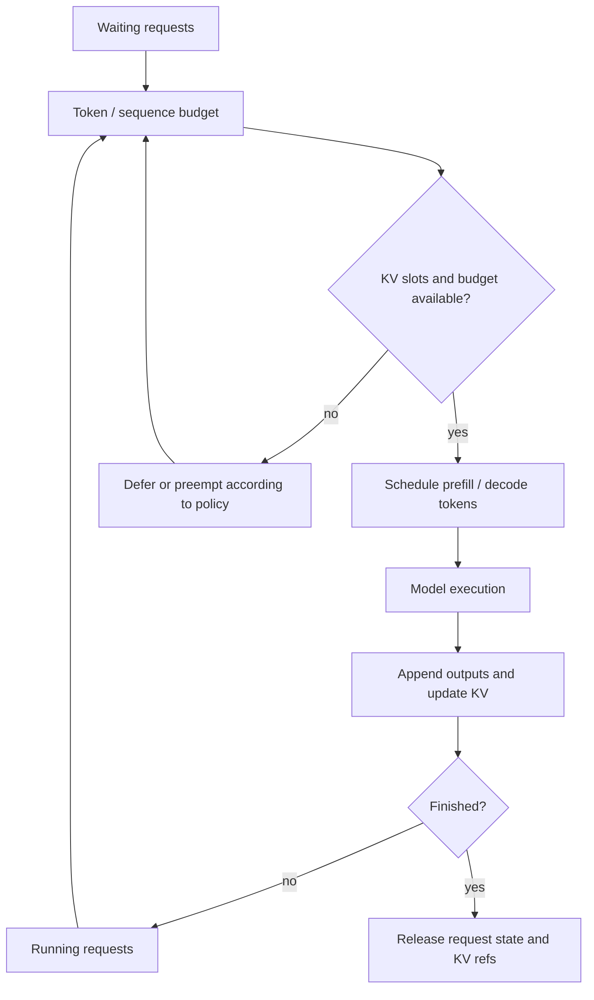

# Continuous Batching

连续批处理（continuous batching / in-flight batching）是在每轮模型执行之间重新选择工作，而不是让一组固定请求从开始运行到全部结束。它是在线 [[llm-inference]] 服务的调度方法：短请求完成后立即让新请求加入，长请求继续 decode，从而尽量避免 GPU 因等待同批其他请求而闲置。

它不同于 [[batch-inference]]：后者通常把有限数据集切成作业批次，完成时间和单请求流式体验不是首要目标；连续批处理面向持续到达、长度未知且常需 streaming 的在线请求。

## 问题模型

在线请求先经历 prefill：为输入 token 计算并写入 KV；随后经历逐 token 的 decode。两者争用同一轮模型执行的 token、序列和 [[paged-attention]] 或 [[radix-attention]] 管理的 KV 空间。调度器必须在吞吐、TTFT、已开始请求的 token 间隔、内存安全与公平性之间取舍。

稳定的抽象是：请求有 waiting 与 running 状态；每一轮根据当前预算选取一部分工作；执行后更新请求状态和 KV 引用。具体队列名称、优先级规则和可同时容纳的阶段由引擎实现决定。

## F1 · 一次 Engine Iteration

该图表示一次 iteration 的控制闭环：waiting 请求竞争进入机会，running 请求竞争下一段 decode；模型执行后才能确认新 token、完成状态和可释放的 KV。不要从图中推断所有引擎都使用同一数据结构、严格 FIFO，或每轮一定同时包含 prefill 与 decode。

## Prefill 与 Decode 如何共享预算

Prefill 的计算量随输入长度增长，decode 每轮通常只为每个活跃序列推进少量 token，却会把活跃 KV 长时间留在显存。一个 iteration 常以 token budget 限制总工作量，以 sequence budget 限制活跃请求数；还必须检查 KV slot 是否可分配。只按 token 数配额会低估长上下文的 KV 压力，只按序列数配额又可能让 GPU 的矩阵计算不饱和。

混合批（mixed batch）允许 prefill token 与 running 请求的 decode token 同轮执行，可减少 decode 空洞并改善资源利用率；但过多 prefill 会拉长已有流式请求的 ITL，过度偏向 decode 又会增大新请求 TTFT。是否支持混合批、如何计量 token 和何时插入 waiting 请求都随引擎和版本变化。[[vllm]] 与 [[sglang]] 都提供这一问题域的实现证据，但其默认策略不应被当作通用规范。

## Chunked Prefill

Chunked prefill 将长 prompt 切为上限受控的片段，跨多个 iteration 逐段处理。在预算紧张时，它避免单个长输入独占一次或多次执行窗口，使 decode 可穿插，从而限制 tail ITL 和排队抖动。

代价是更多调度边界、可能更晚完成该请求的 prefill，以及对 KV 分配与状态续接提出要求。chunk size 不是普适常量：模型、硬件、上下文长度、流式 SLO 和 scheduler 版本都会改变合适值；应通过目标负载测量，而非从某个引擎的默认值外推。

## Preemption 与公平性

KV 槽位或预算不足时，调度器可以延后 waiting 工作，或让部分 running 请求让出资源。抢占可以表现为重算（释放 KV、以后重新 prefill）、swap/offload（将状态移到 CPU 或其他层）或引擎特定的迁移路径；[[kv-cache-offload]] 讨论了后两类存储层代价。不同模式在 GPU 内存、PCIe/NVLink 传输、恢复延迟和实现复杂度之间交换。

公平性不等于每轮完全平均。常见目标是避免长 prompt、低优先级租户或早到请求永久饥饿，同时给交互请求保留可预测的 token 间隔。可采用 age、deadline、tenant quota、最大连续服务量或分层队列；这些 policy 及其优先级语义均为引擎/版本/部署配置相关行为。

## 关键调参

评估连续批处理时，应显式记录而不是只报“开启 batching”：

- 最大 batched token 与最大活跃 sequence：同时影响算力占用、TTFT 和 KV 余量。
- chunk size、长 prompt 准入和 mixed-batch 支持：决定 prefill 是否能打断或挤压 decode。
- preemption mode、swap/offload 容量和恢复代价：决定内存压力下是排队、重算还是搬运。
- 调度 policy、优先级和公平性阈值：决定不同请求/租户在饱和时的体验。
- KV block/page 配置及前缀命中率：分别关联 [[paged-attention]]、[[radix-attention]] 的可分配空间与复用收益。

这些旋钮的名称、默认值、互相约束以及 mixed-batch 支持都随 engine/version 变化。把它们同 [[llm-serving-performance]] 的负载分布、并发和百分位结果一起记录，才可解释某次优化。

## 不要从图中推断什么

该图是调度边界，不是某个仓库的源码、时间线或性能模型。它没有承诺一次 execution 的精确 token 数、KV 的物理布局、抢占一定发生、请求严格按到达顺序服务，或连续批处理必然优于离线批处理。是否有 policy、采用何种 chunk size、使用哪种 preemption mode，以及是否支持 mixed batch，必须回到目标 engine 的版本、配置与测量结果确认。
