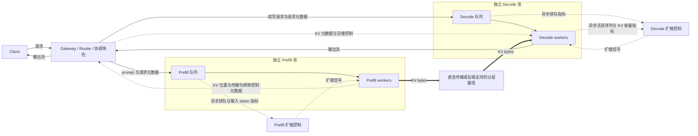
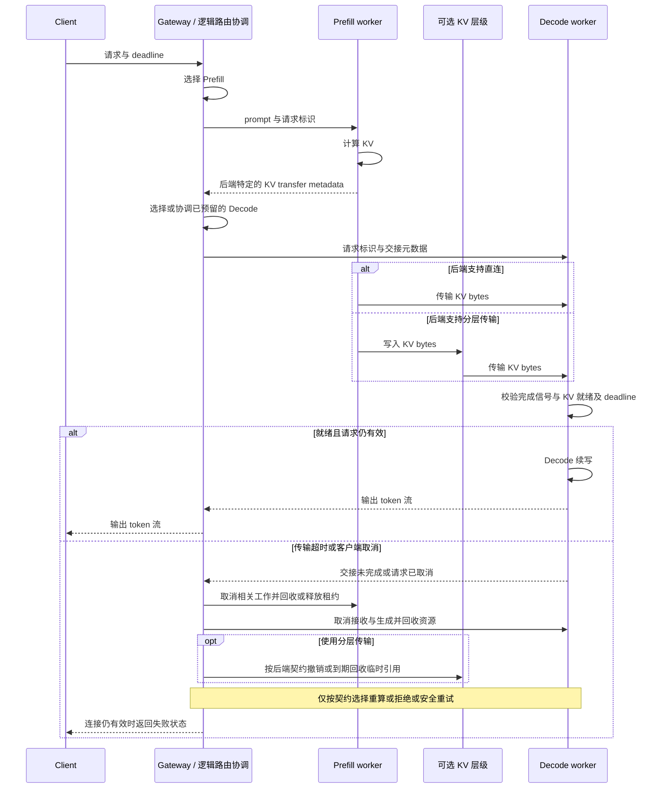

# Disaggregated Serving（分离式服务）

把 LLM 推理的 **prefill（处理 prompt 并生成 KV）** 与 **decode（逐 token 续写）** 拆到独立资源池中分别调度和扩缩的部署模式。首个输出 token 在哪一侧产生由后端约定，不能仅凭 P/D 名称判断。[[dynamo]]、[[vllm]]、[[sglang]] 等项目的具体接口和支持范围见对应实体与 Source 页；本页描述跨实现需要对齐的角色和契约。

## 在 M4 中的位置

P/D 分离同时改变 [[llm-inference-serving-project-map]] 的请求路径和 KV 生命周期：Prefill 与 Decode 独立扩缩，交接时按明确的 backend contract 传递元数据与 KV。[[inference-routing]] 负责端点选择与协调，[[llm-serving-performance]] 解释排队、TTFT、ITL 和传输代价，[[llm-serving-reliability]] 解释取消、超时和故障边界。

## 为什么要分离

Prefill 和 decode 通常具有不同的资源需求，实际瓶颈随模型、batch、上下文长度和硬件变化：

| 阶段 | 计算密度 | 内存压力 | 并行度 | 延迟敏感点 |
|------|----------|----------|--------|------------|
| **Prefill** | 多个输入 token 并行处理，常偏计算受限 | 长 prompt 的 KV 和工作区仍可能很大 | 可按输入 token 预算组织 batch | TTFT（time to first token） |
| **Decode** | 每步处理各序列的新 token，常偏带宽受限 | 驻留 KV 随活跃序列和长度增加 | 连续批处理提高利用率 | ITL（inter-token latency） |

聚合式 serving 由同一组 engine 实例承担两阶段，长 prefill 可能与 decode 争用计算、带宽和调度时间。Chunked prefill、batch 策略和 admission 能缓解干扰，因此分离并非唯一选择，也不保证更快。

P/D 是服务阶段的资源池划分，和 engine 内部 TP（张量并行）、PP（流水线并行）、DP（数据并行）、EP（专家并行）是不同维度。每个池内部仍可使用这些并行方式；跨池的 shard、rank 和 KV layout 是否能映射，需要 connector 明确支持。

## A3 · P/D 分离数据面

下面按职责画出请求、KV 和异步扩缩三条路径。拓扑是角色模型，不是通用进程布局：Gateway、Router、协调器可以合并或拆分，队列也可能位于 engine 内部。

实线表示逻辑请求与输出，粗线表示 KV bytes，虚线按标签区分交接控制与异步指标/扩缩。KV 元数据是位置、句柄、布局和生命周期信息，不等于缓存内容。图假设后端支持所选传输路径，实际 KV 可由发送方推送或接收方拉取。不要从图中推断 KV 必经 Gateway、所有层级存储都可用，或扩缩动作属于请求的同步关键路径。

两池可分别按输入 token 工作量和活跃序列/KV 压力扩缩，但吞吐仍通过交接耦合：Prefill 过快会让待接收 KV、Decode 队列和显存积压，Decode 空闲也可能来自 Prefill 或网络不足。需要联合 admission、队列上限、传输并发和 KV 保留时间，不能仅对两条队列独立追求清零。

## S2 · P/D 请求与 KV Handoff 时序

本图选择“Prefill 返回元数据后协调 Decode”的逻辑顺序。某些实现会先预留 Decode、提前交换传输句柄或重叠计算和传输，必须按后端协议调整；这些顺序不改变就绪校验与资源回收的责任。

交接成功需要接收侧确认可消费的完整状态，收到元数据或提交传输操作都不代表 KV 已可读。图中的取消由协调角色传播，实际发起方、通知顺序和回收确认机制由协议规定；取消可能发生在任一阶段。不要从图中推断统一字段名、传输调用完成即 GPU 可见、取消必然即时完成，或任意故障都能透明续传。

## KV Handoff 契约

| 契约项 | 需要对齐的语义 |
|---|---|
| Request identity | 请求、尝试和会话如何关联，如何防止旧尝试的完成信号污染新尝试 |
| Model / tokenizer / layout compatibility | 模型权重版本、adapter、tokenization、位置编码、KV dtype 和布局兼容，不能只比较模型名称 |
| Block / layout mapping | token 范围、块边界、层与 shard/rank 的映射，哪些转换由 connector 支持 |
| Transfer metadata | KV 的位置、传输句柄、有效期和访问权限，字段名与序列化形式由后端定义 |
| Completion signal | 由谁确认传输完成、目标内存可见且 KV 可消费，如何拒绝部分或过期状态 |
| Cancellation | 传播到计算、传输、接收和临时引用的范围，回收责任与重复取消的处理 |
| Timeout / deadline | 端到端预算如何覆盖排队、计算、传输和就绪等待，超时后谁负责释放资源 |
| Recompute policy | KV 缺失时是否允许从原始输入重算，是否仍有预算，重试是否会重复输出或外部副作用 |

重算依赖输入和执行上下文仍可获得，也依赖后端支持重新进入相应阶段；不能假设总能“只重算 suffix”。首 token 前也要防止重复尝试和资源泄漏。首 token 已发出后，新 worker 的重新采样通常不能视为原输出流的无缝延续，必须遵守显式的会话恢复与输出去重协议，否则终止流并报告失败。路由重选本身不能提供这个保证，详见 [[llm-serving-reliability]]。

## [[dynamo|Dynamo]] 示例的适用范围

[[src-dynamo-architecture]] 记录了 Dynamo 的 P/D 协调和传输实现，包括 backend 特定的交接元数据与 connector。它是本页角色模型的一个实例；组件名称、部署方式、元数据字段及支持的 backend/传输组合以该 Source 对应版本为边界，不构成所有 P/D 系统的统一协议。

## 收益与代价

收益来自阶段隔离、独立 batch 策略和按资源需求配置容量，有机会减少 prefill 对 decode 的干扰。两池也可选择不同硬件，但兼容性、容量利用率和传输成本必须共同评估，不能保证消除 ITL 抖动。

代价包括额外排队、KV 传输、状态协调和故障域。有效带宽取决于 GPU/NIC/NUMA 拓扑、跨机链路竞争及并发传输，设备标称带宽不足以预测 TTFT。短 prompt、小规模部署或互联不足时，聚合式可能更合适。判断应比较同一工作负载下的端到端 SLO、队列、传输时间和成本，见 [[llm-serving-performance]] 与 [[kv-cache-offload]]。

## 相关页面

- 旗舰实现：[[dynamo]]、[[src-dynamo-architecture]]
- 兼容 backend：[[vllm]]、[[sglang]]
- 协同概念：[[kv-cache-offload]]（KV 在多级存储间流动）、[[radix-attention]]（KV-aware 路由配套）
- 上位概念：[[llm-inference]]
