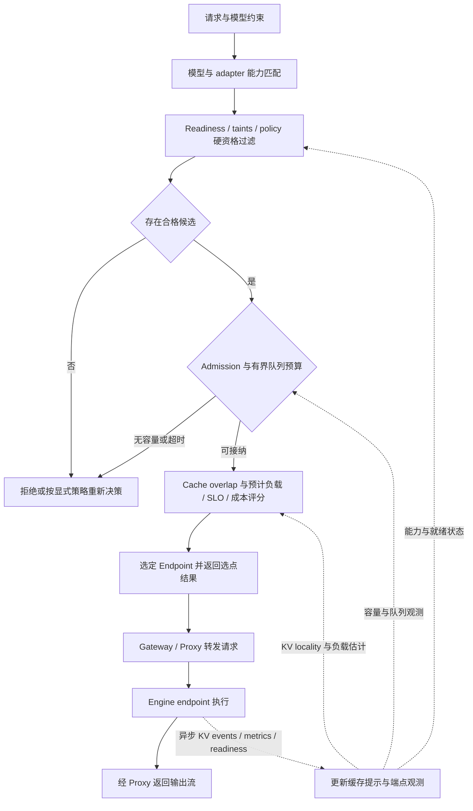

# Inference Routing

Inference routing 指 LLM/模型服务请求进入 serving fleet 后，如何选择 provider、模型、endpoint、pod、prefill/decode worker 或 KV cache 命中路径。

## 在 M4 中的位置

Routing 位于流量入口与 engine 执行之间。[[llm-inference-serving-project-map]] 展示职责边界与请求路径，区分 Gateway、Proxy/EPP/Router 和 Model Server。路由负责选择请求去向，engine 负责执行推理；[[llm-serving-performance]] 说明选择效果的衡量方式，[[llm-serving-reliability]] 说明故障与会话状态的边界。

## 路由决策层次

| 类型 | 代表 | 决策信号 |
|---|---|---|
| Gateway/API endpoint picking | [[gateway-api-inference-extension]], [[llm-d-router]] | endpoint health、metrics、InferencePool、目标模型 |
| 语义/模型能力路由 | [[semantic-router]], RouteLLM | prompt semantic、成本/质量、guard、模型能力 |
| KV/cache aware routing | [[llm-d-kv-cache]], [[dynamo]], [[kthena]], [[aibrix]] | prefix overlap、KV block location、worker load、LoRA/cache affinity |
| Batch-to-serving dispatch | [[llm-d-batch-gateway]] | batch job、per-model plan、processor concurrency、下游 endpoint capacity |
| Edge/provider governance | [[envoy-ai-gateway]], [[ai-gateway]] | auth、provider、quota、rate limit、audit、fallback |

## 选型提示

不要把所有 router 混为一类。[[llm-d-router]] / Gateway API router 更靠近 Kubernetes endpoint；semantic router 更靠近 prompt/model selection；KV-aware router 更靠近 serving runtime 和 cache locality，[[llm-d-kv-cache]] 则把 KV event/index/scoring 这层单独拆出来。[[dynamo]] 的不同 selection host 是部署组合示例，具体集成及版本边界见 [[src-dynamo-architecture]]，不应据此假设各项目采用同一选点评分算法。

[[llm-d-inference-sim]] 对 routing 选型很有用：它不会给出真实 GPU 性能，但能在无 GPU 环境中模拟 OpenAI/vLLM API、KV block/cache events、TTFT/ITL 和 fake metrics，从而验证 endpoint picking、KV-aware scoring 和 autoscaling 闭环。[[llm-d-batch-gateway]] 则说明 batch workload 的“路由”更多发生在 processor 的 per-model plan 和并发控制层，不应和在线低延迟 request routing 混在一起评估。

## F3 · Endpoint 选点与反馈闭环

模型或 provider 的选择可发生在本图之前。本图假设已知目标模型与请求约束，展示 endpoint 候选集的过滤、准入、评分和反馈，具体信号不要求每个项目都实现。

实线表示一次决策到转发的逻辑顺序，虚线表示影响后续决策的异步反馈。图假设准入预算有明确的执行者，实际可能由 Gateway、调度器或 engine 分担。不要从图中推断存在一个集中式全局队列、指标强一致、选点即容量预留，或请求正文和输出流必须经过独立的选点服务。

## 四类信号与决策顺序

| 信号族 | 典型内容 | 决策作用与边界 |
|---|---|---|
| Hard eligibility | 模型/adapter 能力、readiness、taints、租户/区域/权限约束 | 先排除不可用或不允许的候选，禁止用高 cache 分数抵消硬约束 |
| Load / queue | 排队 token、活跃请求、KV 容量、在途分配和预计服务时间 | 驱动准入、有界等待及负载评分，区分观测值与容量预留 |
| KV locality | prefix overlap、块位置、缓存层级、命中置信度与事件新鲜度 | 估计可省计算与读取/传输代价，缓存接近不代表一定值得等待 |
| Policy / SLO / cost | 优先级、TTFT/ITL 预算、成本权重、租户公平性 | 硬政策在过滤阶段执行，软偏好在合格候选之间权衡 |

硬过滤先于评分。准入通过之后，评分应考虑新请求加入后的预计负载，而不只是上一次抓取的 queue 长度；选点与真正接收之间仍有竞争，engine 需要再次确认容量与请求合法性。Cache affinity 不是无条件粘滞：命中最高的 endpoint 可能过载，排队或远程读 KV 的时间也可能超过重算成本。具体目标和负载模型见 [[llm-serving-performance]]。

## 网关层与 Endpoint Router 的组合

Gateway/Proxy 可以通过 EPP 或 ext-proc 向选择服务咨询，携带后者需要的请求元数据或内容，并取得目标 endpoint 后直接转发给 engine。请求正文与输出流不必穿过独立选择服务，选择服务也不因此拥有会话或 KV。哪些内容会被送去检查、协议在哪一层介入，取决于具体部署配置。

这几层可以组合，但不是必须全部部署。[[envoy-ai-gateway]] 解决 provider 与边缘治理，[[semantic-router]]/[[routellm]] 解决模型/能力选择，[[gateway-api-inference-extension]] 定义标准协议，[[llm-d-router]] 负责 Kubernetes serving endpoint 选择。

## 反馈新鲜度、会话归属与失败边界

KV events 和指标通常异步到达，会丢失、延迟或乱序。只有当 engine 对实际缓存命中、内容兼容性和请求合法性保持权威校验时，过期 locality 才主要损害优化质量：错误估计会导致额外排队、读取或重算，仍可能违反延迟 SLO。若把提示直接当成可消费 KV 的证明，过期信息就可能变成正确性问题。索引应支持失效和重建，接收侧必须校验实际状态。

可重建的 cache hint 与权威 session ownership 是不同状态。前者帮助选择更快的去向；后者若被协议用于约束续写、输出序号、取消和重试，就必须有明确的所有者、转移与故障恢复机制，不能随 KV 索引丢失而任意重建或改派。

路由不能修复不兼容的 KV layout，也不能自行恢复任意中途断流。[[disaggregated-serving]] 的 P/D 交接需要模型、布局、完成信号和超时契约；首 token 前的改派也要满足重试预算和去重约束，首 token 后则需明确的会话恢复协议，否则应报告流失败。详见 [[llm-serving-reliability]]。
