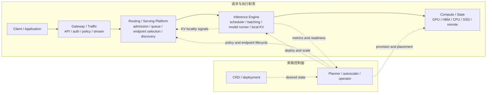
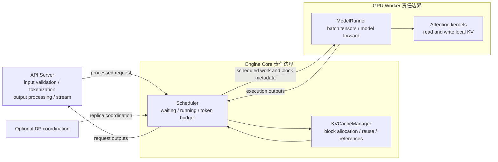
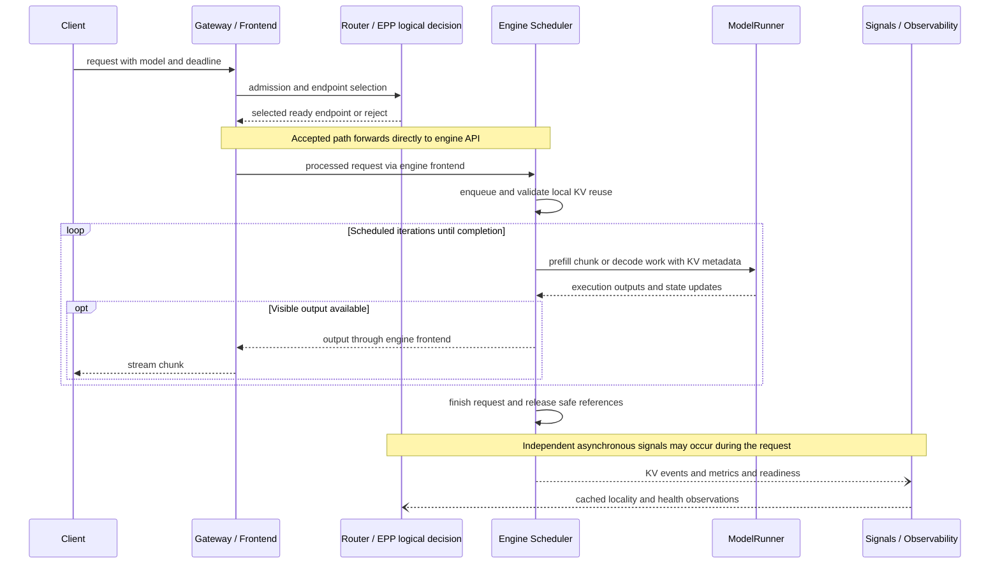
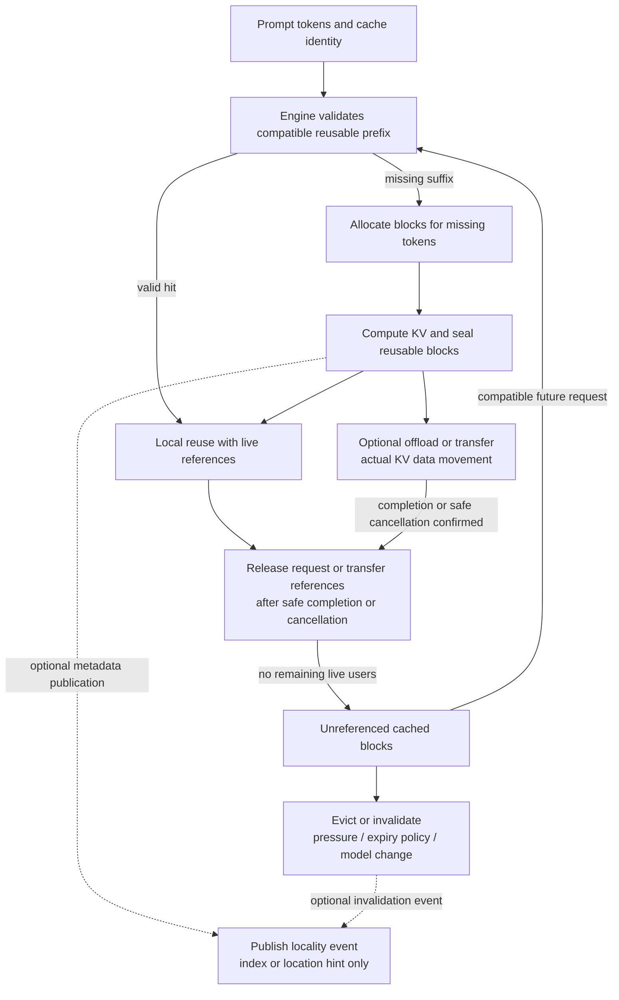

# LLM Inference

## 本页回答什么

本页面向 AI Infra / Serving 工程师：沿一个生成请求，定位 API 合同、路由准入、引擎执行、KV 状态、跨 GPU 协作和运维的责任归属，再决定需要哪些项目组合。LLM inference 是模型执行，serving 还包括把执行能力交付为可接入、可度量、可恢复的在线服务或异步作业。

先读下面的 workload 与 SLO，再沿七步路径下钻。项目全景由 [[llm-inference-serving-project-map]] 维护，组合与取舍由 [[llm-serving-engine-selection-map]] 维护；本页负责把它们接回一条请求生命周期。

## 先定义 Workload

| 工作负载 | 首先固定的条件 | 沿请求路径观察什么 |
|---|---|---|
| 在线交互 | 输入/输出长度分布、到达率、并发、streaming、租户优先级 | 排队与首 token、持续输出间隔、取消、尾延迟 |
| Batch / 异步 | 数据集规模、完成时限、重试与输出持久化合同 | job 状态、可恢复进度、有效产出与成本，见 [[batch-inference]] |
| 重复前缀 / Agent 多轮 | 共享 prompt、会话长度、工具轮次、模型/adapter revision、隔离边界 | 前缀命中、路由 locality、KV 驻留时间；单轮快不等于整个任务快 |
| 长上下文 / 多模态 | 长度尾部、图片/音频等输入形态、processor 成本、实际模型 token 展开 | 预处理、prefill、KV 容量与带宽；文本 token 数不能代表全部输入成本 |

这些类别可以重叠：Agent 请求可能同时是在线、长上下文和多模态。记录模型与硬件、量化、并行配置和缓存冷热条件，才能解释同一请求为何在不同部署上表现不同。

## 先定义 SLO

把用户可接受的响应变成可检验合同：交互服务约束首 token、输出间隔和端到端尾延迟，同时规定成功率、deadline、取消与过载拒绝；异步服务更关注完成时限、结果完整性和可恢复性。吞吐优化必须说明满足这些约束的有效产出以及失败分母。

TTFT、ITL、TPOT、goodput 的口径与实验矩阵见 [[llm-serving-performance]]；首 token 前后重试、backpressure 和清理责任见 [[llm-serving-reliability]]。本页不预设跨模型、硬件和负载通用的数字目标或默认参数。

## 端到端阅读路径

1. API / SLO → routing / admission / queue：先声明请求与流式合同，再用 [[inference-routing]] 理解模型选择、候选端点与有界准入，区分入口排队和 engine waiting queue。
2. Engine schedule / batch / execute：读 [[continuous-batching]]，再沿 [[vllm]] / [[sglang]] 的 scheduler、ModelRunner 和 attention backend 看一轮执行。
3. KV 生命周期：通过 [[paged-attention]]、[[radix-attention]] 理解分配与复用，再读 [[kv-cache-offload]] / [[elastic-kv-cache]]，区分引用、逻辑块与物理内存。
4. 分布式执行 / P-D / 并行：读 [[disaggregated-serving]]，区分阶段交接与 DP/TP/PP/EP，检查传输、拓扑和故障成本。
5. 控制 / 扩缩 / GPU：读 [[model-serving-operator]] 与 [[k8s-gpu-device-stack]]，追踪声明式部署如何变成已加载模型的 ready 容量。
6. 观测 / 可靠性：用 [[llm-serving-performance]] 与 [[llm-serving-reliability]] 把请求耗时、队列、KV、readiness 和故障关联起来，再做压测与故障演练。
7. 项目组合 / 选型：回到 [[llm-inference-serving-project-map]] 和 [[llm-serving-engine-selection-map]]，依据上述瓶颈选择层与组合，并验证引擎、connector、控制面版本及部署成本。

## A1 · 端到端 Serving 分层架构

解读：实线概括请求处理及执行所依赖的资源，虚线表示控制或异步信号。图是责任地图，方框可以合并、拆分或省略，不能据此数网络跳数。控制面根据期望状态与观测调整容量，不在每次同步生成的热路径上。

假设：以提供在线生成 API 的平台为背景；CPU、SSD 和 remote 只是可能的状态层级，是否使用取决于部署。路由职责可以在 gateway 内实现，也可以委托外部 selector。

不要从图中推断每个系统必须部署所有方框、全部 KV 层级都开启，或每个请求/token 都要等待 operator、planner、autoscaler。GPU 设备交付见 [[k8s-gpu-device-stack]]，生命周期边界见 [[model-serving-operator]]。

## A2 · Engine V1 进程与执行边界

解读：API 处理输入与输出，scheduler 决定本轮工作并管理 KV 预算，worker/runner 执行模型和 kernels。实线是逻辑交互，包含请求提交、执行与结果回传；真实实现可以异步、流水或重叠执行。

假设：用 [[vllm]] V1 的 EngineCore、Scheduler、KVCacheManager 与 GPUModelRunner 命名提供具体代码锚点，证据见 [[src-vllm-architecture]]。[[sglang]] 对应的 Scheduler、ScheduleBatch、UnifiedRadixCache、ModelRunner 及 tokenizer/detokenizer 边界见 [[src-sglang-architecture]]；它们并非同名类或相同进程拓扑。

不要从图中推断 vLLM 与 SGLang 的类、线程、IPC 和进程数量一致，或一次前向严格只产生一个 token。这里抽取共享责任模型；逐函数调用、并行与 speculative 路径应按 Source 页记录的版本查阅。

## S1 · 聚合式在线请求时序

解读：先作逻辑选端点决策，再由代理把请求转发给选中的 engine；scheduler 多轮选择工作，执行结果经过 frontend 输出为流。KV events、metrics 和 readiness 独立更新观测或路由视图，不是每个生成 token 的阻塞依赖。

假设：展示请求成功完成、prefill 与 decode 聚合在同一 engine 服务单元的路径；engine frontend 的输入处理与输出处理折叠在往返箭头中。router 可以内嵌，也可以通过外部 EPP 提供选择结果；拒绝和失败路径见 [[llm-serving-reliability]]。

不要从图中推断请求正文和 token 流必须经过 EPP 进程、每轮都有可见输出、stream chunk 等于一个 token，或异步信号只在请求结束后发布。是否调用 selector、采集频率与健康观察滞后由具体实现决定。

## F2 · KV Block 生命周期

解读：复用命中可以跳过已缓存前缀的计算，未命中部分才分配并写入 KV。可复用块可以留在本地、公布位置，或通过 connector 搬运真实数据；这些分支可以并存。请求结束释放引用，缓存仍可保留，直到符合驱逐条件。

假设：采用块/页式 KV 与可选前缀缓存；seal 表示实现认定该块可安全复用，不要求有同名 API。partial block、过期策略与模型切换的处理依引擎而定；仍被 GPU 或传输使用的状态必须先安全终止访问，再回收。没有启用前缀缓存时，未引用空间可以直接回收。

不要从图中推断 locality index 含有 KV tensor、发布事件保证缓存一直存在、完成请求必然立刻清空物理页，或远端命中可绕过 engine 校验。模型/revision、adapter、token 前缀与隔离身份的兼容性由 engine/connector 合同校验；[[llm-d-kv-cache]] 的索引是线索，[[kv-cache-offload]] 才讨论数据迁移，[[elastic-kv-cache]] 讨论物理页占用。

## 按责任下钻

### 执行：谁获得下一轮 GPU 时间

[[continuous-batching]] 解释 iteration 的 token/sequence/KV 预算、chunked prefill、抢占与公平性。Prefill 为输入建立 KV，decode 继续推进生成；算力或带宽是否成为瓶颈取决于 batch、上下文和硬件，不能仅凭阶段名称判断。

[[paged-attention]] 关注 KV 分页寻址与碎片，[[radix-attention]] 关注前缀组织与复用。Speculative decoding、量化、LoRA 混排与多模态 processor 会改变执行和内存需求；沿 [[vllm]] / [[sglang]] 及 Source 页查目标模型、kernel 和版本支持，再用同一 workload 验证收益。

### 状态：谁拥有 KV，何时可以释放

[[kv-cache-offload]] 研究 HBM、CPU、SSD 或远端之间的数据搬运与恢复代价；[[elastic-kv-cache]] 与 [[kvcached]] 研究在保留引擎逻辑 KV 语义的同时调整 GPU 物理页占用。块可定位、身份匹配、真实数据可访问、安全保留引用是不同条件，路由命中率不能代替这些正确性检查。

### 分布式：并行计算、请求分配与阶段交接

引擎内部 TP 切分张量计算，PP 切分模型层并形成流水，EP 分布 MoE experts，DP 复制执行容量；不同引擎的 DP/EP 组合还可能有协调通信。它们描述模型执行组织，需要核对通信域、权重/KV 布局和拓扑。

实例级路由是在可用服务端点之间分配请求；[[disaggregated-serving]] 则将 prefill 和 decode 放在不同执行资源上，新增 KV 交接及失败边界。一个 P 或 D 池内部仍可用 TP/PP/DP/EP。控制面部署或扩缩这些单元，属于另一个时间尺度；三者不能互相替代。[[dynamo]] 与 [[llm-d]] 的具体组合入口见项目地图。

### 平台：谁接纳流量，谁改变容量

[[inference-routing]] 区分模型选择、endpoint picking 与 KV locality 信号；[[model-serving-operator]] 区分声明式期望、模型装载、ready 副本与扩缩。扩容要经过资源供给和模型初始化，因此当前请求仍需要有限队列、deadline 和过载策略。

Kubernetes serving stack 的紧凑比较按责任选入口，具体能力与版本以 [[src-k8s-serving-stack-comparison]] 和实体页的证据为准：

| 要补齐的职责 | 项目入口 | 采用前首先核对 |
|---|---|---|
| Gateway / endpoint picking 与分布式 serving | [[llm-d]]、[[aibrix]] | gateway 协议、engine/connector、KV 信号与故障合同 |
| 模型 API 与 runtime 生命周期 | [[kserve]]、[[kubeai]]、[[ome]] | CRD 与已有部署兼容性、模型装载、升级及 scale-to-zero 条件 |
| 多角色 workload 与拓扑编排 | [[rbg]]、[[kthena]] | P/D 角色语义、协调升级、调度器与 GPU 拓扑依赖 |
| GPU / 多模型服务平台 | [[gpustack]] | 资源纳管范围、认证计量、现有 K8s 平台整合成本 |

[[llm-d-workload-variant-autoscaler]] 保留为 deprecated 的历史设计与迁移材料；此处不把旧方案当作新部署默认值。现行扩缩接线应沿实体页的日期与证据重新确认。

### 运维：如何证明容量与恢复合同

[[llm-serving-performance]] 给出可比负载与容量测量，[[llm-serving-reliability]] 给出取消、重试、陈旧 KV 信号和故障演练。[[inference-perf]] / [[llm-d-benchmark]] 提供负载与实验组织入口；[[llm-d-inference-sim]] 支持低成本验证路由与控制流程，但仿真结果不能替代真实 GPU/kernel 的性能测量。

[[batch-inference]] / [[llm-d-batch-gateway]] 补充异步作业、重试、状态与结果持久化。下游 engine 可以继续使用连续批处理；在线/异步是交付合同，continuous batching 是执行调度机制。

## 稳定概念与版本化实现

本页的稳定部分是责任划分、请求生命周期、状态所有权与观测方法。vLLM V1 命名、SGLang 对象、connector、CRD 和 autoscaling 接线是版本化实现证据，按 [[src-vllm-architecture]]、[[src-sglang-architecture]] 及各实体/Source 页标注的快照解读。本次重组不代表重新验证了上游最新版本，也不声明通用默认开关、进程数或性能排序。

带着 workload、SLO、瓶颈和运维约束进入 [[llm-serving-engine-selection-map]]：单引擎已满足目标时无需增加分布式交接；要采用 P/D、远端 KV 或新控制面，应先测量收益能否覆盖网络、状态一致性、故障恢复和迁移成本。
